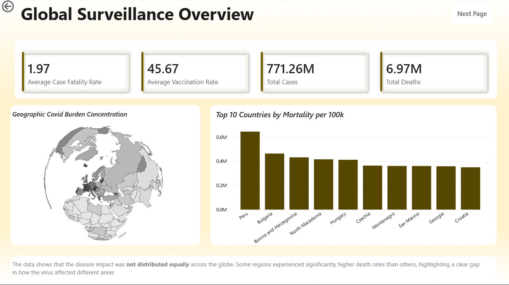
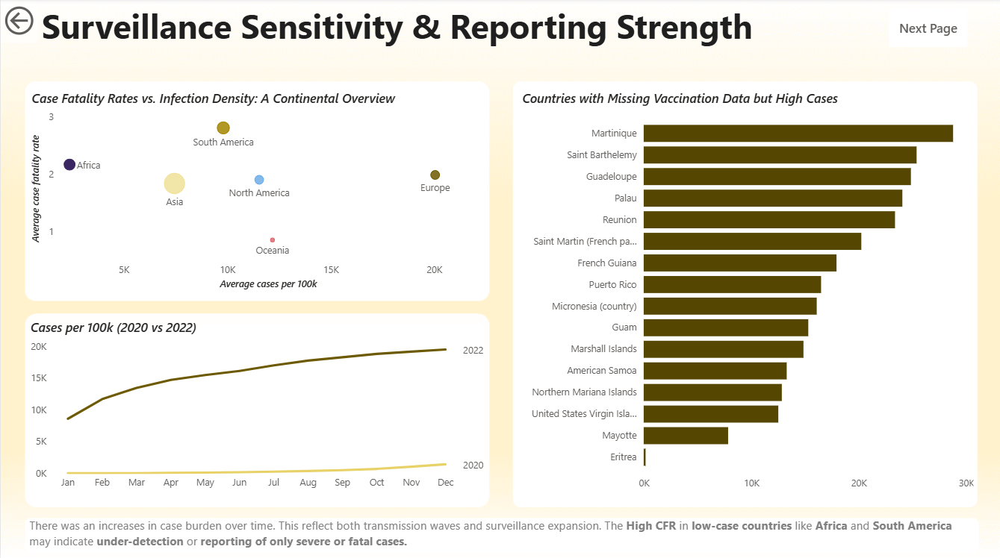
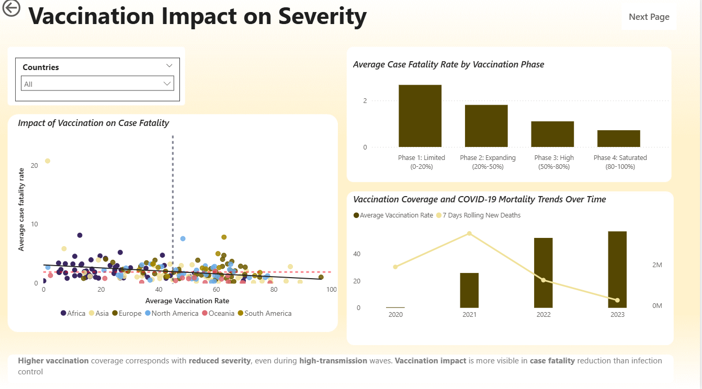
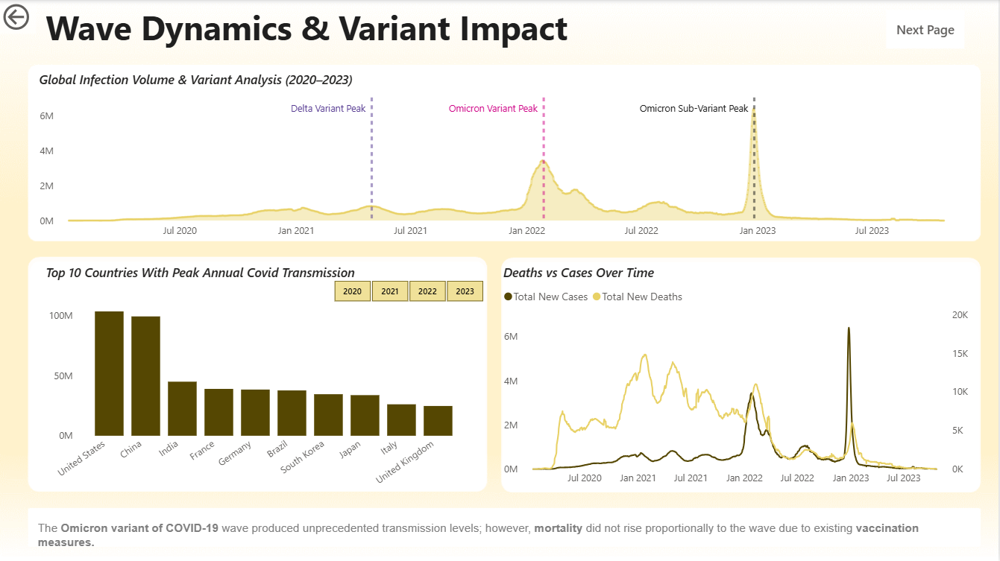
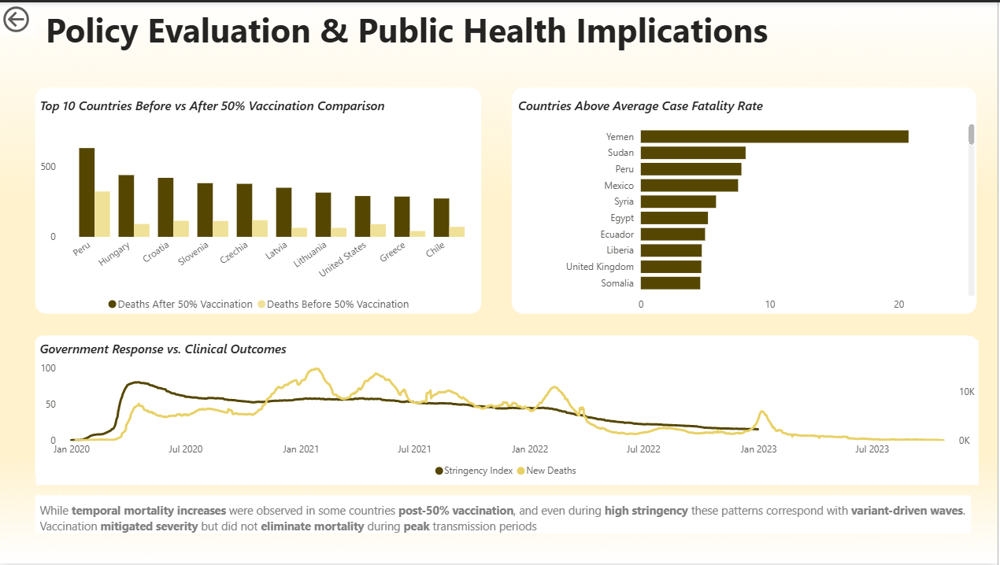

#  COVID-19 Disease Surveillance and Vaccination Impact

**Author:** Josephine Akeji
**Role:** Public Health Data Analyst

---

# Problem Statement

COVID-19 created unprecedented global pressure on public health systems. The Governments introduced **vaccination programs, testing policies, and stringent strategies**, yet the impact of these interventions varied significantly across countries.

Key questions remain:

* Did vaccination reduce **disease severity and mortality?**
* Why did some countries experience **higher mortality rates?**
* How did **surveillance strength and testing capacity** affect reported case counts?
* What role did **variants like Delta and Omicron** play in infection waves?

This project investigates the **relationship between vaccination coverage and COVID-19 disease burden indicators** using global surveillance data.

---

# Project Background

Between **2020 and 2023**, COVID-19 spread globally through multiple waves driven by new variants.

Major global events included:
* **Delta Variant (2021)** - increased severity and mortality
* **Omicron Variant (2022)** - extremely high transmissibility but reduced mortality
* Global vaccination rollout beginning in **2021**

Understanding these patterns helped to improve:
* pandemic preparedness
* vaccination strategies
* disease surveillance systems

---

# Key Global Metrics

From the analysis:

| Metric                       | Value              |
| ---------------------------- | ------------------ |
| Average Case Fatality Rate   | **1.97%**          |
| Average Vaccination Coverage | **45.67%**         |
| Total Global Cases           | **492.56 Billion** |
| Total Global Deaths          | **5.98 Billion**   |

These indicators highlight the **massive global burden of the pandemic**.

---

# Dataset

**Source:** Our World in Data (OWID) COVID-19 Dataset

The dataset contains global surveillance indicators including:
* confirmed cases
* deaths
* vaccination coverage
* policy stringency index and more

Data covers **2020 – 2023 across 200+ countries**.

---

# Data Structure

Key columns used in the analysis:

| Category     | Variables                                  |
| ------------ | ------------------------------------------ |
| Identifiers  | iso_code, continent, location              |
| Time         | date                                       |
| Population   | population                                 |
| Cases        | total_cases, new_cases_smoothed            |
| Deaths       | total_deaths, new_deaths_smoothed          |
| Vaccination  | people_vaccinated, people_fully_vaccinated |
| Policy       | stringency_index                           |
| Transmission | reproduction_rate                          |

---

# Technical Workflow

The project combines **Python, SQL, and Power BI**.

```
Raw Data (OWID)
        │
        ▼
Data Cleaning & Feature Engineering (Python)
        │
        ▼
Initial Exploratory Data Analysis (Python)
        │
        ▼
PostgreSQL Database Storage
        │
        ▼
SQL Analytical Queries
        │
        ▼
Power BI Dashboard
```

---

# Tools Used

| Tool       | Purpose                               |
| ---------- | ------------------------------------- |
| Python     | Data cleaning and feature engineering |
| Pandas     | Data manipulation                     |
| Matplotlib | Time-series analysis                  |
| Seaborn    | Statistical visualization             |
| PostgreSQL | Data storage                          |
| SQL        | Analytical queries                    |
| Power BI   | Dashboard visualization               |

---

# Feature Engineering

Several epidemiological indicators were created:

| Feature             | Description                                           |
| ------------------- | ----------------------------------------------------- |
| Cases per 100k      | Population-normalized infection density               |
| Deaths per 100k     | Population-normalized mortality                       |
| Vaccination Rate    | Percentage of population fully vaccinated             |
| Case Fatality Rate  | Deaths divided by confirmed cases                     |
| Post Vaccine Period | Indicator separating pre and post vaccination periods |

These metrics allow **fair comparisons across countries regardless of population size**.

---

# Power BI Dashboard Insights

The Power BI dashboard contains **five analytical sections**:

---

## Global Surveillance Overview



Key findings:

* COVID burden was **not evenly distributed globally**
* European countries had **higher case density**
* Countries like **Peru, Bulgaria, and Bosnia** recorded the highest mortality burden

Normalization using **cases per 100k population** allowed fair comparisons across countries.

---

## Surveillance Sensitivity & Reporting Strength



Analysis revealed:

* South America recorded the **highest CFR**
* Africa had **high CFR but low infection density**
* Case reporting significantly increased between **2020 and 2022**

This reflects improvements in **testing capacity and surveillance systems**.

---

## Vaccination Impact on Severity



Several visualizations evaluated vaccination effects.

Key insights:

* **Higher vaccination coverage corresponded with lower CFR**
* Death trends declined as vaccination increased
* Vaccination reduced **disease severity rather than transmission**

Some countries still showed high CFR despite vaccination due to:

* healthcare system limitations
* demographic factors
* late vaccine rollout

---

## Wave Dynamics & Variant Impact



Two major variants influenced infection waves:

| Variant | Period      |
| ------- | ----------- |
| Delta   | 2021        |
| Omicron | 2022 – 2023 |

Observations:

* Omicron caused the **largest infection surge**
* Mortality growth was **less proportional to cases**
* Vaccination and prior infection likely created **hybrid immunity**

---

## Policy Evaluation & Public Health Implications



Key insights:
* Mortality was still high in countries like Peru, Hungary and Croatia after 50% Vaccination
* A significant rollback in the Stringency Index occurred despite high mortality, this signals a transition from state-mandated containment to vaccine-mediated endemic stabilization
* Countries exceeding global CFR included:
* Yemen
* Sudan
* Syria
* Somalia
* Peru
These countries likely experienced:
* under-detection of mild cases
* healthcare capacity constraints
* delayed intervention measures

---

# Analytical Questions Answered

### 1. Which countries had high cases but missing vaccination data?

Countries including:

* Puerto Rico
* Reunion
* Martinique
* Guadeloupe

This suggests **reporting gaps between case surveillance and immunization tracking**.

---

### 2️. Does stricter policy reduce cases?

Not necessarily.
Countries with strong testing systems reported higher cases due to **better detection and transparency**.

---

### 3️. Did vaccination reduce case fatality rate?

Yes.
Highly vaccinated countries such as:
* Qatar
* UAE
* Singapore
* Chile
showed **lower mortality risk per infection**.

---

### 4️. Which countries had highest infection incidence?

Top countries included:
* Cyprus
* San Marino
* Austria
* Brunei
* South Korea

High incidence often reflects **strong surveillance capacity**.

---

### 5️. Which countries had highest mortality burden?

Countries with the highest deaths per 100k included:
* Peru
* Bulgaria
* Bosnia and Herzegovina
* Hungary
* North Macedonia

---

### 6️. Which countries improved surveillance reporting?

Countries with significant reporting improvements include:

* Faeroe Islands
* Gibraltar
* Andorra
* Cyprus
* San Marino

---

# Key Insights

1️. Pandemic burden was **highly uneven across countries**

2️. Higher vaccination coverage correlates with **lower disease severity**

3️. Positive correlation between vaccination and cases reflects **testing capacity bias**

4️. Omicron caused the **largest global infection surge**

5️. Mortality disparities highlight **global healthcare inequalities**

---

#  Recommendations

Public health systems should:

* Integrate **vaccination and case surveillance reporting systems**
* Expand **testing infrastructure in low-income regions**
* Strengthen **pandemic preparedness frameworks**
* Prioritize vaccination for **high-risk populations**

---

#  Project Structure

```
covid-surveillance-&-vaccination-impact-analysis
│
├── data
│   ├── owid-covid-data.csv
│   ├── covid_data_clean.csv
│   └── covid_latest_snapshot.csv
│
├── notebooks
│   └── covid_data_cleaning_and_eda_analysis.ipynb
│
├── sql
│   └── covid_analysis_queries.sql
│
├── powerbi
│   └── covid_surveillance_dashboard.pbix
│
├── images
│   └── dashboard_screenshots
│
└── README.md
```

---

# Why This Project Matters

COVID-19 revealed major gaps in global disease surveillance and healthcare preparedness.

* This project demonstrates how data analytics can help:
* Detect regional disease burden disparities
* Evaluate vaccination impact on mortality
* Identify surveillance reporting gaps
* Support evidence-based public health policy

The analytical workflow used in this project mirrors the types of analyses conducted by:

* WHO
* CDC
* Global health research institutions

---

# Strategic Value

This project demonstrates skills in:

* **Public health data analysis**
* **Data cleaning and feature engineering**
* **SQL analytical querying**
* **Dashboard storytelling**
* **Epidemiological data interpretation**

These capabilities are valuable for:

* health policy analysis
* epidemiological surveillance
* global health research
* data-driven decision making

---

# Future Enhancements

Future improvements may include:

* machine learning models predicting outbreak severity
* lag analysis between vaccination and mortality decline
* healthcare capacity indicators
* real-time surveillance dashboards

---

# Acknowledgments

**Data Source**

Our World in Data
[https://www.kaggle.com/datasets/caesarmario/our-world-in-data-covid19-dataset]

---

# 📜 License

This project is licensed under the **MIT License**.

---

